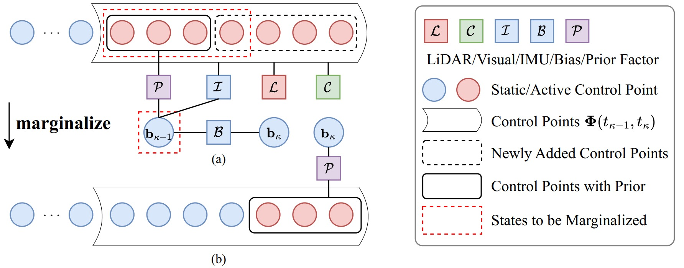
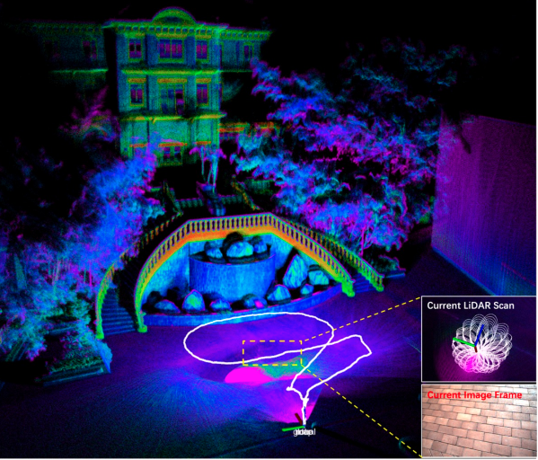

# Coco-LIC

*News📝: Occupied by so many tasks over the past few months😭, we now ultimately have time to clean up the code and the code will be released in April!*

---

Coco-LIC: Continuous-Time Tightly-Coupled LiDAR-Inertial-Camera Odometry using Non-Uniform B-spline

 

Coco-LIC is a continuous-time tightly-coupled LiDAR-Inertial-Camera Odometry system based on non-uniform B-Splines. In contrast to uniform B-spline-based methods, it offers significant advantages in terms of efficiency and accuracy. This is accomplished by dynamically and adaptively placing control points, taking into account the varying dynamics of the motion. A novel way to enable efficient fusion of LiDAR-Inertial-Camera data within a short sliding window is also proposed for continuous-time framework.

The source code will be available after the publication of the related paper.

## Comparison of Uniform and Non-Uniform Placement 

1 control point per 0.1 seconds **vs** adaptively adjusting control points per 0.1 seconds.

 

## Evaluation on challenging degenerate dataset

The odometry and mapping result of Coco-LIC on the sequence degenerate_seq_00 of [R3LIVE Dataset](https://github.com/ziv-lin/r3live_dataset), where severe LiDAR degeneration happens when Livox Avia faces the ground for a while. Coco-LIC overcomes the degradation and succeeds in returning to the origin.

 
