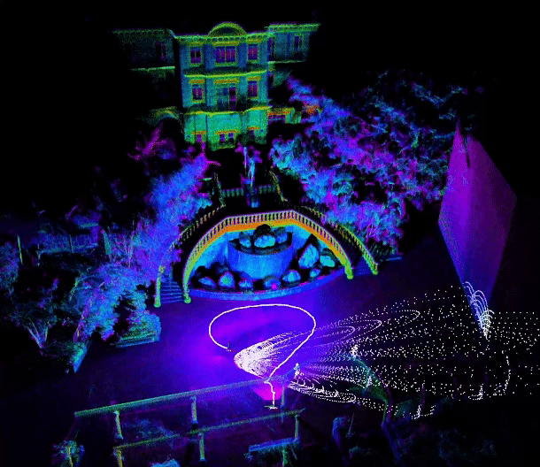
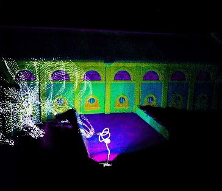
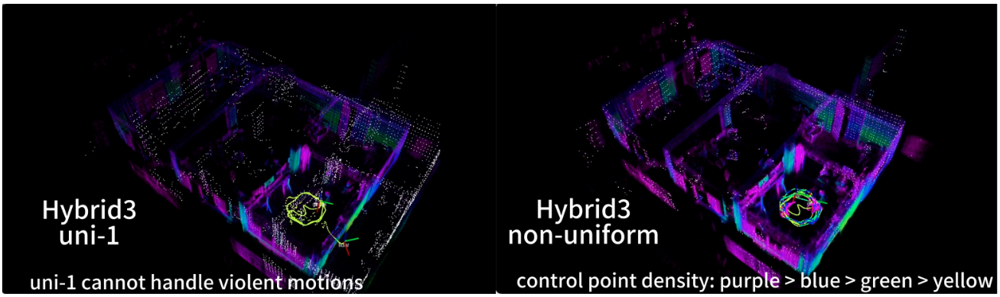
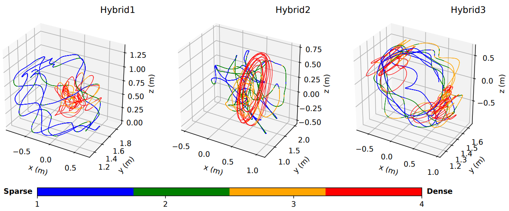
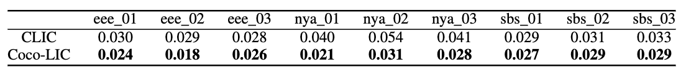

# Coco-LIC

**Coco-LIC: Continuous-Time Tightly-Coupled LiDAR-Inertial-Camera Odometry using Non-Uniform B-spline**

<p>



</p>

The following are three main characters of 🥥 Coco-LIC [[`Paper`](https://arxiv.org/pdf/2309.09808)] [[`Video`](https://www.youtube.com/watch?v=M-vlxK4DWno)] :

+ **dynamically** place control points to unlock the real power of the continuous-time trajectory
+ tightly fuse LiDAR-Inertial-Camera data in a **short sliding window** based on a factor graph
+ support **multimodal multiple** LiDARs and achieve great performance in **degenerated** cases 

## Prerequisites

+ ROS（tested with noetic）
+ Eigen 3.3.7
+ Ceres 2.0.0
+ OpenCV 4
+ PCL >= 1.13
+ [livox_ros_driver](https://github.com/Livox-SDK/livox_ros_driver)
+ yaml-cpp

## Install

```shell
mkdir -p ~/catkin_ws/src
cd ~/catkin_ws/src
git clone https://github.com/Livox-SDK/livox_ros_driver.git
cd ~/catkin_ws && catkin_make
cd ~/catkin_ws/src
git clone https://github.com/APRIL-ZJU/Coco-LIC.git
cd ~/catkin_ws && catkin_make
source ~/catkin_ws/devel/setup.bash
cd ~/catkin_ws/src/Coco-LIC && mkdir data
```

## Run

+ Download [R3LIVE dataset](https://github.com/ziv-lin/r3live_dataset) or [FAST-LIVO dataset](https://connecthkuhk-my.sharepoint.com/personal/zhengcr_connect_hku_hk/_layouts/15/onedrive.aspx?id=%2Fpersonal%2Fzhengcr%5Fconnect%5Fhku%5Fhk%2FDocuments%2FFAST%2DLIVO%2DDatasets&ga=1) or [NTU-VIRAL dataset](https://ntu-aris.github.io/ntu_viral_dataset/) or [LVI-SAM dataset](https://drive.google.com/drive/folders/1q2NZnsgNmezFemoxhHnrDnp1JV_bqrgV).

+ Configure parameters in the `config/ct_odometry_xxx.yaml` file.

  - `log_path`: the path to log
  - `config_path`: the path of `config` folder 
  - `bag_path`: the file path of rosbag  

+ Run on R3LIVE dataset for example.

  ```shell
  roslaunch cocolic odometry.launch config_path:=config/ct_odometry_r3live.yaml
  ```

  The estimated trajectory is saved in the folder `./src/Coco-LIC/data`.

## Supplementary1 - non-uniform verification

1 control point per 0.1 seconds 🥊 adaptively placing control points per 0.1 seconds.

 

The different colors of the trajectory correspond to different densities of control points.

 

## Supplementary2 - comparison on NTU-VIRAL

We additionally compare Coco-LIC with our previous work [CLIC](https://github.com/APRIL-ZJU/clic) on NTU-VIRAL dataset, employing 1 LiDAR. 

The best results are marked in bold. It can be seen that Coco-LIC stably outperforms CLIC.

 

## TODO List

- [ ] serve as the front-end of incremental 3D Gaussian Splatting（[Gaussian-LIC](https://arxiv.org/pdf/2404.06926)）
- [ ] optimize the code architecture (rosbag play mode) and support ikd-tree for acceleration

## Citation

If you find our work helpful, please consider citing 🌟:

```bibtex
@article{lang2023coco,
  title={Coco-LIC: continuous-time tightly-coupled LiDAR-inertial-camera odometry using non-uniform B-spline},
  author={Lang, Xiaolei and Chen, Chao and Tang, Kai and Ma, Yukai and Lv, Jiajun and Liu, Yong and Zuo, Xingxing},
  journal={IEEE Robotics and Automation Letters},
  year={2023},
  publisher={IEEE}
}
```
```bibtex
@article{lv2023continuous,
  title={Continuous-time fixed-lag smoothing for lidar-inertial-camera slam},
  author={Lv, Jiajun and Lang, Xiaolei and Xu, Jinhong and Wang, Mengmeng and Liu, Yong and Zuo, Xingxing},
  journal={IEEE/ASME Transactions on Mechatronics},
  year={2023},
  publisher={IEEE}
}
```

## Acknowledgement

Thanks for [Basalt](https://gitlab.com/VladyslavUsenko/basalt-headers), [LIO-SAM](https://github.com/TixiaoShan/LIO-SAM/tree/a246c960e3fca52b989abf888c8cf1fae25b7c25), [Open-VINS](https://github.com/rpng/open_vins), [VINS-Mono](https://github.com/HKUST-Aerial-Robotics/VINS-Mono), [R3LIVE](https://github.com/hku-mars/r3live) and [FAST-LIVO](https://github.com/hku-mars/FAST-LIVO).

## LICENSE

The code is released under the [GNU General Public License v3 (GPL-3)](https://www.gnu.org/licenses/gpl-3.0.txt).
